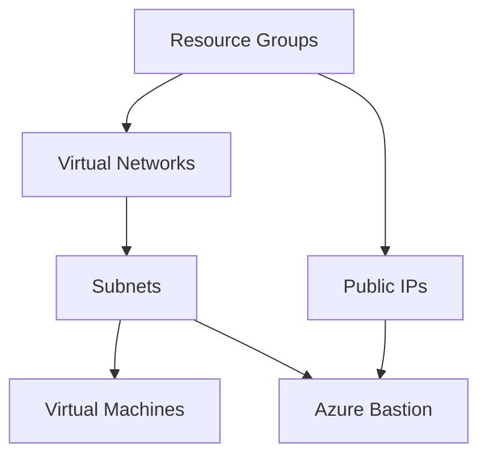

# 🚀 Azure Landing Zone - Infrastructure as Code (IaC)

A modular and scalable **Terraform** repository for deploying and managing an **Azure Landing Zone** infrastructure across multiple environments (`preprod`, `prod`).

---

## 📋 Overview

This repository uses Terraform to automate the provisioning of foundational Azure networking, compute, and security resources using a modular architecture. Each resource component is decoupled into reusable modules and dynamically instantiated using map-based input variables (`for_each`).

---

## 📁 Repository Structure

```text
Azure_Landing_zone/
├── .github/
│   └── workflows/
│       └── main.yml           # GitHub Actions CI pipeline for feature branches
├── enveroment/                # Environment-specific configurations
│   ├── preprod/              # Pre-production environment deployment
│   │   ├── provider.tf        # Terraform & AzureRM provider configuration
│   │   ├── main.tf            # Module invocations & dependency graph
│   │   ├── variable.tf        # Input variable declarations
│   │   ├── terraform.tfvars   # Environment configuration values
│   │   └── .gitleaks.toml     # Gitleaks secret scanning configuration
│   └── prod/                 # Production environment directory
├── module/                    # Reusable Terraform infrastructure modules
│   ├── azurerm_resource_group/ # Azure Resource Group module
│   ├── azurerm_virtual_network/# Azure Virtual Network (VNet) module
│   ├── azurerm_subnet/         # Azure Subnet module
│   ├── azurerm_public_ip/      # Azure Public IP module
│   ├── azurerm_VM/             # Azure Virtual Machine (Linux/Windows) module
│   └── azurerm_bastion/        # Azure Bastion Host module
├── .gitignore
└── README.md
```

---

## 🛠️ Modules Breakdown

| Module | Description | Input Variables |
| :--- | :--- | :--- |
| **`azurerm_resource_group`** | Provisions Azure Resource Groups dynamically using `for_each`. | `rgs` |
| **`azurerm_virtual_network`** | Creates VNets with custom CIDR address spaces linked to Resource Groups. | `vnets` |
| **`azurerm_subnet`** | Provisions subnets inside specified Virtual Networks. | `subnets` |
| **`azurerm_public_ip`** | Allocates Static/Dynamic Public IP addresses in Azure. | `pips` |
| **`azurerm_VM`** | Provisions Compute VMs with dynamic NIC creation and data source lookups. | `vms` |
| **`azurerm_bastion`** | Deploys Azure Bastion Host for secure PaaS management access. | `bastion_app` |

---

## ⚙️ Resource Dependency Flow

The infrastructure resources are applied according to the following explicit dependency chain:



---

## 🚀 Getting Started

### Prerequisites

- [Terraform CLI](https://developer.hashicorp.com/terraform/downloads) (>= 1.5.0)
- [Azure CLI](https://learn.microsoft.com/en-us/cli/azure/install-azure-cli)
- An active **Azure Subscription** with appropriate RBAC permissions (Contributor/Owner).

### 1. Authenticate with Azure

```bash
az login
az account set --subscription "<YOUR_SUBSCRIPTION_ID>"
```

### 2. Choose Environment & Initialize

Navigate to the target environment directory:

```bash
cd enveroment/preprod
terraform init
```

### 3. Validate & Format Check

```bash
terraform fmt -check
terraform validate
```

### 4. Generate Execution Plan

```bash
terraform plan
```

### 5. Apply Changes

```bash
terraform apply
```

---

## 🔄 CI/CD Pipeline

Automated checks are powered by **GitHub Actions** (`.github/workflows/main.yml`).

- **Trigger:** Triggers automatically on `push` to any `feature/**` branch.
- **Pipeline Workflow Steps:**
  1. 📥 Checkout repository code (`actions/checkout@v4`)
  2. 🛠️ Setup Terraform CLI (`hashicorp/setup-terraform@v3`)
  3. ⚙️ Run `terraform init`
  4. 📐 Run `terraform fmt -check -recursive`
  5. ✅ Run `terraform validate`
  6. 📊 Run `terraform plan`

---

## 🔐 Security & Best Practices

- **Secret Scanning:** `.gitleaks.toml` is configured to prevent committing sensitive keys/secrets into repository code.
- **State Management:** Ensure Terraform remote backend (Azure Blob Storage) is configured for collaborative deployments.
- **Module Reusability:** Map inputs (`for_each`) are used across all modules to eliminate code duplication.